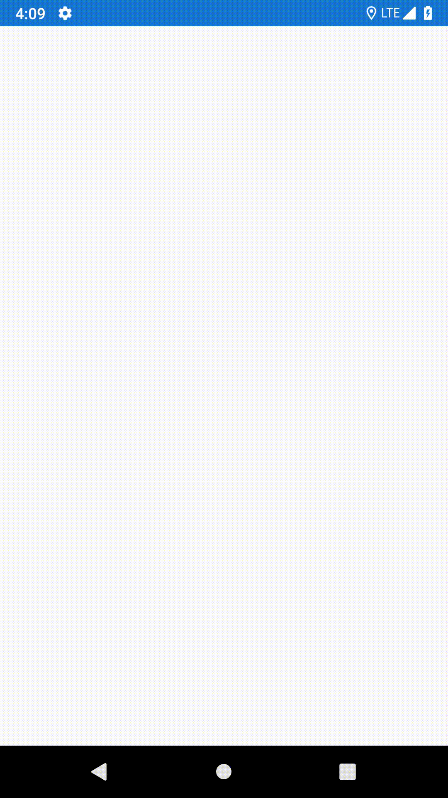

# Tangent.Controls.WebViewAuth  
[](https://tangentsolutions.visualstudio.com/TangentMobileComponents/_build/latest?definitionId=262)
[](https://tangentsolutions.visualstudio.com/TangentMobileComponents/_packaging?_a=package&feed=2ce6cfaf-4d0c-4d70-97ff-62771294df1a&package=5ee7c55f-5a90-4760-9900-9aee170710f9&preferRelease=true)
## Introduction  
This control allows you to view webviews with basic authentication

 

## Getting Started  
### Installation  

Install this package into your forms project  
Install this package into your platform projects

### Configuration  

In your platform projects, add the following line of code after your Xamarin.Forms.Init()
```
Tangent.Controls.WebViewAuthRenderer.Init();
```

### Usage  
In your XAML Page, add the namespace
```
 xmlns:controls="clr-namespace:Tangent.Controls.WebViewAuth;assembly=Tangent.Controls.WebViewAuth"
```

In your XAML Page, use the control like this
```
        <controls:EnhancedWebView
            x:Name="EnhancedWeb"
            Username="admin@123"
            Password="admin"
            Source="https://google.com"
            HorizontalOptions="FillAndExpand"
            VerticalOptions="FillAndExpand" />
```
#### Parameters:
* Username: username property required by auth
* Password: password property required by auth
* Source: https url required
